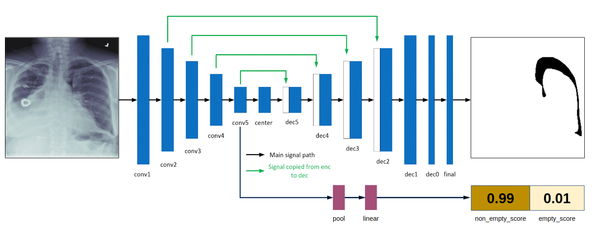

# The 4th Place Solution of SIIM-ACR Pneumothorax Segmentation

## Solution
My solution is based on UNet with a deep supervision branch for empty mask classification.



* Model: UNet.
* Backbone:  ResNet34 backbone with frozen batch-normalization.
* Preprocessing: training on random crops with `(512, 512)` size, inference on `(768, 768)` size.
* Augmentations: ShiftScaleRotate, RandomBrightnessContrast, ElasticTransform, HorizontalFlip from albumentations.
* Optimizer: Adam, batch_size=8
* Scheduler: CosineAnnealingLR
* Additional feature: the proportion of non-empty samples linearly decreased from 0.8 to 0.22 (as in train dataset) depending on the epoch. It helped to converge faster.
* Loss: `2.7 * BCE(pred_mask, gt_mask) + 0.9 * DICE(pred_mask, gt_mask) + 0.1 * BCE(pred_empty, gt_empty)`.  Here `pred_mask` is the prediction of the UNet, pred_empty is the prediction of the branch for empty mask classification.
* Postprocessing: 
```if pred_empty &gt; 0.4 or area(pred_mask) &lt; 800: pred_mask = empty.```
Parameters are selected on the validation set.
* Ensemble: averaging the 4 best checkpoints over 8 folds, horizontal flip TTA.
* Hardware: 4 x RTX 2080

## Docker
```
make build
make run
make exec
```

## How to run?
```
cd scripts
bash train.sh
bash test.sh
bash ensemble.sh
bash submit.sh
```

## References
* https://github.com/albu/albumentations
* https://github.com/open-mmlab/mmdetection
* https://github.com/SpaceNetChallenge/SpaceNet_Off_Nadir_Solutions/blob/master/selim_sef